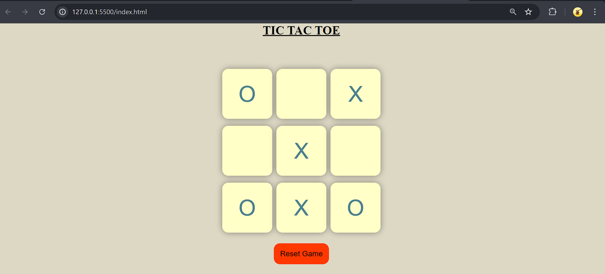
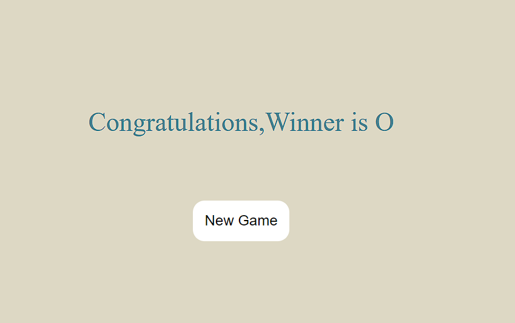

# Tic Tac Toe Game

Welcome to the **Tic Tac Toe Game** repository! This project is a simple yet fun implementation of the classic Tic Tac Toe game, built using HTML, JavaScript, and CSS. Whether you're a beginner looking to learn web development or an experienced developer wanting to see a straightforward example of these technologies in action, this project is for you.

## Features

- **Interactive Gameplay:** Play against another human player in a turn-based Tic Tac Toe game.
- **Responsive Design:** The game board adapts to different screen sizes, making it playable on both desktop and mobile devices.
- **Dynamic Updates:** The game board updates in real-time as you make moves, providing immediate feedback.
- **Stylish UI:** Clean and simple user interface designed with CSS to enhance the gaming experience.

## Screenshots




## Getting Started

### Prerequisites

To run this game locally, you need a web browser. No additional installations are required.

### Installation

1. **Clone the repository:**
    ```bash
    git clone https://github.com/your-username/tic-tac-toe.git
    ```
2. **Navigate to the project directory:**
    ```bash
    cd tic-tac-toe
    ```
3. **Open the `index.html` file in your browser:**
    ```bash
    open index.html
    ```

## How to Play

1. The game is for two players, X and O. Player O always goes first.
2. Players take turns clicking on an empty cell to place their mark (X or O).
3. The first player to get three of their marks in a row (horizontally, vertically, or diagonally) wins the game.
4. If all nine cells are filled and no player has three marks in a row, the game is a draw.

## Contributing

Contributions are welcome! If you have suggestions for improvements or find any bugs, feel free to create an issue or submit a pull request.


